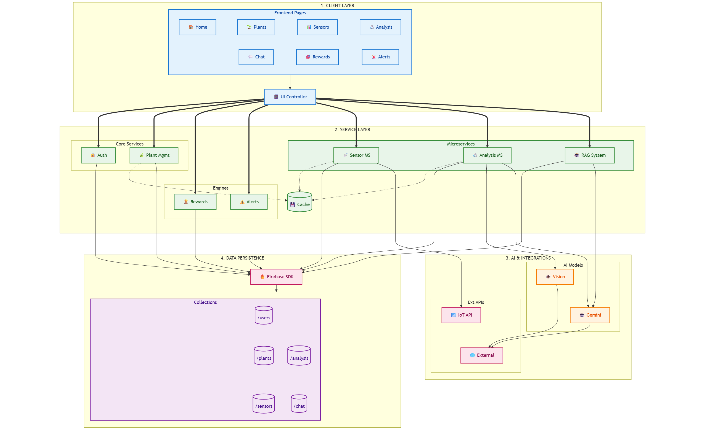

# 🌿 PlantSense AI Studio

> **An interactive AI-powered plant monitoring system optimized for Google Colab.**

## 📖 Overview

**PlantSense AI Studio** is a unified, single-file application that brings professional plant care technology to an educational environment. Designed to run seamlessly in Google Colab, it combines simulated IoT monitoring, computer vision for disease diagnosis, an academic RAG assistant, and gamified care missions into one interactive dashboard.

Unlike complex microservice deployments, this "Studio" edition packs all advanced logic—from Vision Transformers to Firebase synchronization—into a straightforward Python implementation accessible to researchers and hobbyists alike.

## ✨ Key Features

*   **📊 Unified Dashboard**: Real-time visualization of simulated sensor data (Moisture, Temp, Light) with interactive gauges and charts.
*   **🍂 AI Disease Diagnosis**: A hybrid analysis pipeline using **MobileNetV2** for immediate classification and **Google Gemini** for detailed, actionable treatment advice.
*   **🤖 Academic RAG Chat**: A lightweight Retrieval-Augmented Generation system that answers query using a curated dictionary of academic papers and an custom inverted index.
*   **🎮 Gamification Engine**: Turn plant care into a game with Experience Points (XP), Daily Missions, Streaks, and Level-up rewards.
*   **☁️ Cloud Sync**: Fully integrated with **Firebase Realtime Database** to persist plant data, user progress, and analysis history across sessions.
*   **📄 PDF Reporting**: automated generation of detailed PDF health reports for any analyzed plant.

## 🏗️ System Architecture

The system utilizes a **Monolithic "Studio" Architecture**, where the Frontend (UI), Logic (AI/Data), and Persistence layers run within a single robust Python process.

### Core Components
1.  **UI Layer**: Built with `ipywidgets` to deliver a responsive, app-like experience directly in the notebook output cell.
2.  **Analysis Pipeline**: Orchestrates `PyTorch` models for vision and `LangChain` for LLM reasoning.
3.  **Data Managers**: Dedicated classes (`FirebaseREST`, `GamificationEngine`) handle state management and cloud synchronization.

